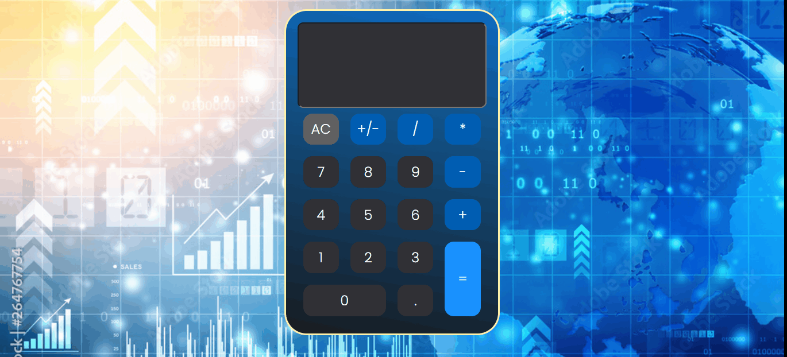

# Projeto - Calculadora
Um projeto que buscou demonstrar a criação de uma calculadora com intenção de realizar cálculos matemáticos com as suas bases definidas. Design, desenvolvimento de códigos e toda estrutura pensadas de maneira fácil e compreensiva. Com o acionamento dos botões que contém os números e o acionamento do símbolo da operação matemática será possível obter os resultados de infinitas possibilidades.🚀❤🙌

[]

## Tecnologias utilizadas 🚀
- HTML5
- CSS3
- JAVASCRIPT
- PHOTOSHOP

## Por que desenvolvi o projeto ?

Este trabalho foi desenvolvido com intuito de demonstrar minhas habilidades com a programação por meio da elaboração de uma calculadora . O projeto mostra a seleção dos números com a combinação da operação matemática que se queira realizar, obtendo o resultado desta operação na tela. Todo design também foi desenvolvido por mim com o auxílio da ferramenta photoshop.
Espero que curtam e ajude compartilhando !!! 

Feito com ❤ por Fabiano Dias Moreira 👏 [Veja meu linkedIn](https://www.linkedin.com/in/fabiano-dias-moreira-b851b7217/)